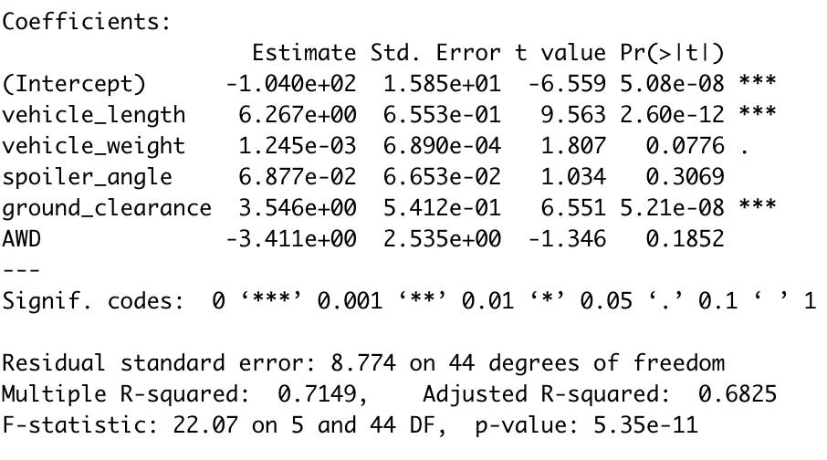
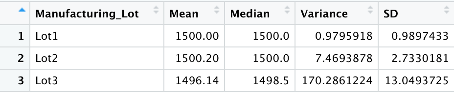
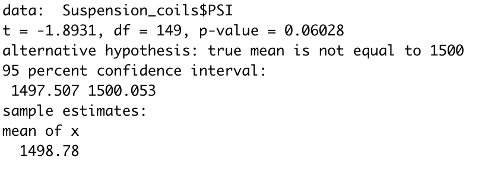
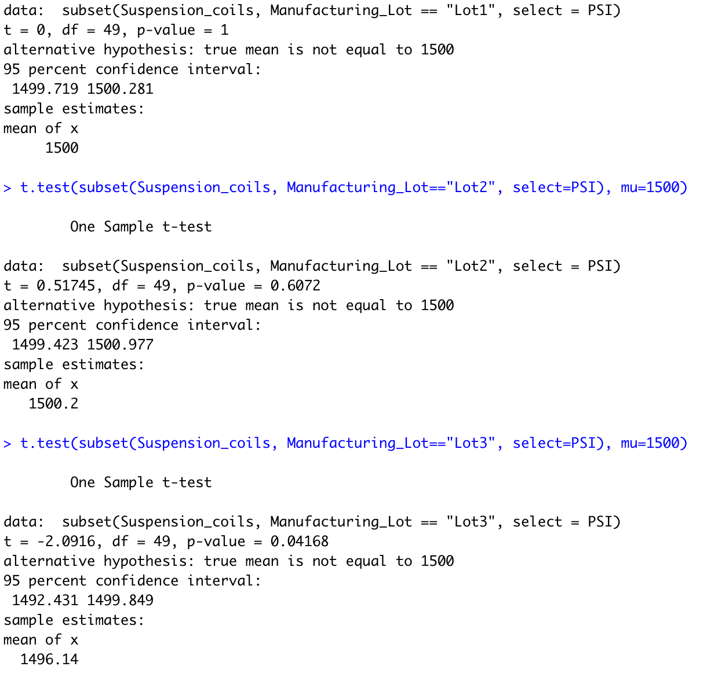

# MechaCar_Statistical_Analysis

## Linear Regression to Predict MPG

Which variables/coefficients provided a non-random amount of variance to the mpg values in the dataset?

- Both vehicle length and ground clearance don't seem to have much effect on MPG while the other variables do.

Is the slope of the linear model considered to be zero? Why or why not?

- Multiple regression models use multiple "lines" and coefficients to represent data in a way that cannot be graphed in the same way a single linear regression can. Therefore there is no real measure of slope for the whole model.

Does this linear model predict mpg of MechaCar prototypes effectively? Why or why not?

- This model can fairly accurately predict mpg. The p-value is very low indicating a strong correlation and the r-squared value is quite high indicating that much of the data can be explained within the linear regression model.

## Summary Statistics on Suspension Coils

The design specifications for the MechaCar suspension coils dictate that the variance of the suspension coils must not exceed 100 pounds per square inch. Does the current manufacturing data meet this design specification for all manufacturing lots in total and each lot individually? Why or why not?

- Lots 1 and 2 both have variances within acceptable limits. Lot 3, though it adhears to the average PSI reading, has a variance well beyond specifications (more that 200 PSI). If you only looked at manufacturing as a whole with all lots accounted for in one dataset, all lots are within the 100 PSI variance limit.

## T-Tests on Suspension Coils

- Pictured are the t-tests for the entire maufacturing lot, then the tests for each lot individually. All the lots together have a statistically similar mean to 1500. Both lots 1 and 2 are very statistically similar to our goal mean while lot 3 is lagging behind. As evidenced by our summary statistics for each lot, this is probably due to the much higher level of inconsistancy from the lot 3 production line.

## Study Design: MechaCar vs Competition

Using your knowledge of R, design a statistical study to compare performance of the MechaCar vehicles against performance of vehicles from other manufacturers.

The data we have from MechaCar is relevant for MPG. Whatever other metrics you choose would depend on the kinds of buyers Mechacar is selling to. If they are performance cars, MPG might not be a very important measure. It would be great to compare horse power/torque numbers with other companies. It also might be interesting to measure body panel gaps and compare the consistency and build quality with other manufacturers.

Much like the suspention coil tests, you could pick a handful of common panel gaps (like front fender/door, bumper, etc.) and measure the gaps between them in nanometers. You could then measure the variance of panel gaps compared to other manufacturers to tout build quality. 
